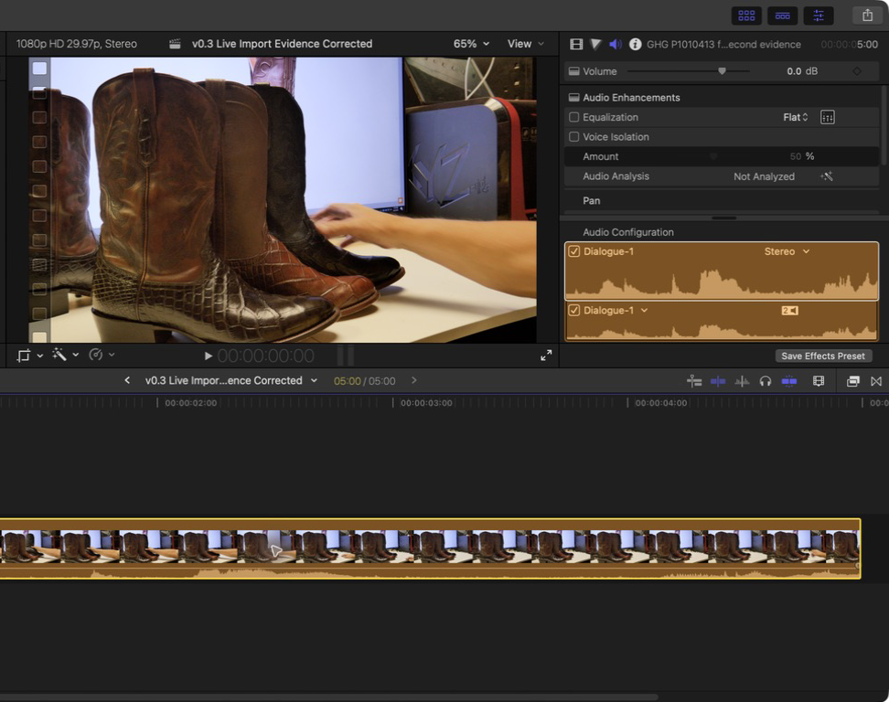

# fcp-mcp v0.3.0 pre-release product evidence

This is fresh local pre-release evidence for `fcp-mcp` 0.3.0: a built and
separately installed artifact plus a real Final Cut Pro handoff. It is not a
publication, tag, or claim of autonomous Final Cut Pro control. The exact
machine-readable paths, commands, hashes, and result bindings are in
[v0.3.0-provenance.json](v0.3.0-provenance.json).

## Evidence identity

- Evidence source revision: `0fe558be0040422701a75c67cdf04c9a8cbac253`
  (`codex/v0.3-product-polish`), before the evidence-document commits.
- Runtime: macOS 26.5.2 (build 25F84), Final Cut Pro 12.2
  (`com.apple.FinalCut`), Python 3.12.13.
- DTD: `/Applications/Final Cut Pro.app/Contents/Frameworks/Interchange.framework/Versions/A/Resources/FCPXMLv1_11.dtd`.
- Installed catalog: `inspect=30/2/0`, `workflow=34/3/3`, `edit=75/5/3`,
  `full=94/5/3` (tools/prompts/resources). Default remains inspect, prepare,
  review, hash approval, then commit.
- Documentation naming macOS 15.6 records an earlier baseline; this evidence
  is specifically macOS 26.5.2 and does not relabel it.

## Built and installed artifact

The base-revision distributions below passed `twine check`. The wheel—not the
later inventory build—was installed and executed.

| Base artifact | SHA-256 |
| --- | --- |
| `fcp_mcp-0.3.0-py3-none-any.whl` | `527b7cc46789125168a84999569c81e866804559e7dfa2a07a4c924d2612c7fb` |
| `fcp_mcp-0.3.0.tar.gz` | `cafd4ce4319723c6992b2fc4228e1fac503fb5a618da80b0d3845673cc7be2b8` |

The exact wheel at
`/private/tmp/fcp-mcp-v030-evidence-r1/dist/fcp_mcp-0.3.0-py3-none-any.whl`
installed in a new Python 3.12 venv. Its `direct_url.json` binds that absolute
path and hash; `fcp-mcp --version` returned `fcp-mcp 0.3.0`. The resolved
console script, interpreter, site-packages import, out-of-tree cwd, and safe
argv/environment records are retained in provenance. Doctor was degraded only
because optional Apple Compressor was absent; Final Cut Pro and FFmpeg/ffprobe
were present, and live control remained disabled.

## Installed sample and workflow trajectory

The installed `sample` command materialized the packaged first-run fixture at
SHA-256 `c54521e017d140cdf059fd950c7c286f0182e9622cd74ecacdfb83436b97ec02`.
That sample check is separate from the installed-wheel workflow smoke below;
it is not presented as the workflow source.

The retained Python 3.12 workflow run is
`790da06a-04f7-48e8-a9e8-78014a464f6c`. It used source SHA-256
`5e0cfbe2647123c21d53c00ba75174736e7e127d2b26d0fb52722092242564d4`
and plan SHA-256
`79f29fcedf1cdc5ca645b1445bef525b5b6ec84998501458c238ff6a51d5bf0a`.
The two reviewed operations added marker `Wheel smoke` to clip `Clip` and
assigned its role `Dialogue`; the semantic diff contains four bound changes.

- Candidate and committed output SHA-256:
  `782f96039ed8a14e68bbbbf5649d719e3e81f8ef7c90a7c3dc2d74d7cb9bb3ff`.
- Diff artifact SHA-256:
  `c3303bd83dccc021b9817f0606d44eca79e8915dbcbbdcd45a331f7e3403d71a`.
- Logical receipt hash embedded in the receipt:
  `d93bc297999668f9d1ff6b5da7ee484a6fb3a921db9479c3a86ad7ad657adc8b`.
- Serialized `receipt.json` artifact SHA-256, which equals the ledger
  `receipt_sha256`:
  `2adc2bc2b7fc8795671ac5ce263a8a868e6ad16f4692c41363040db2d94b7d32`.

Prepare left the destination absent; commit bound the exact candidate hash;
validation returned `valid: true` with the expected synthetic-source warning
that `Clip` has no source path. SQLite `integrity_check` returned `ok`, and the
event chain terminates in `committed` at sequence 10.

## Real-media Final Cut Pro handoff

The authorized, not copied source was `/Volumes/Extreme SSD/GHG/P1010413.MP4`:
2,252,375,418 bytes; SHA-256
`b51ebe8fa82bc452ea882292d955808b01af11c572925c5785c94fca152308d1`.
`ffprobe` found H.264 3840x2160 at `30000/1001`, stereo 48 kHz AAC, and
191.191 seconds.

The corrected FCPXML at
`/private/tmp/fcp-mcp-v030-evidence-r1/live/v0.3-live-import-corrected.fcpxml`
declares the true `5735730/30000s` asset duration and selects source
`900900/30000s` for `150150/30000s` (5.005 seconds / 150 frames). Its
SHA-256 is
`2b60935326c91072fc26835441c5256774747385353e82e8cf8743843a6f9404`.
The lxml-based `scripts/apple_dtd_gate.py` passed against Final Cut Pro's
installed 1.11 DTD. No `xmllint --valid` success is claimed: the retained XML
has no external SYSTEM identifier. Direct macOS `xmllint --dtdvalid` emitted
`xmlSAX2ResolveEntity`, so the lxml gate is the authoritative DTD result.

Using Final Cut Pro's native File > Import > XML dialog and Go to Folder, the
operator selected that exact corrected path while the distinct disposable
`v0.3-live-import-corrected-evidence.fcpbundle` was active. Import returned
without a warning dialog; this is an operator observation, not something the
final screenshot alone proves. The operator then explicitly opened event
`v0.3 Evidence Corrected` / project `v0.3 Live Import Evidence Corrected` and
selected its single clip. Final Cut Pro visibly reported `00:00:05:00`, a
video filmstrip, audio waveform, `1080p HD 29.97p, Stereo`, and `Dialogue-1`.

The image is a genuine Final Cut Pro capture, cropped only: 972x768 PNG,
SHA-256 `ffe16f48cf6d2eb97cb9f5265efabcff414aab9885fa5f190a0906a835956894`.
The crop preserves the corrected project identity, duration, filmstrip,
waveform, format, and role while excluding the local path and unrelated
library/project sidebar.

## Inventory build and validation

The base artifacts above are the only artifacts installed for execution. A
separate post-evidence wheel and sdist were built only to check package
inventory; they were neither installed nor published.

| Corrected inventory-only artifact | SHA-256 |
| --- | --- |
| `fcp_mcp-0.3.0-py3-none-any.whl` | `4216820abc0c1b0e58af986dd94194162e82756e1a77b0294d8d8bad2c7b1ff1` |
| `fcp_mcp-0.3.0.tar.gz` | `91c324b2a8d4c49f6bb3a4144291c88605bae153b7a30cef4dfd7a1e3678e064` |

The sdist contains the release note, provenance JSON, and corrected PNG; the
wheel remains code/package-data only. The machine-readable record gives the
three included member hashes. Because a provenance file cannot contain the
SHA-256 of an archive that contains that same final byte sequence, the public
note/provenance append these artifact hashes after construction; the member
hashes identify the exact pre-attestation copies included.

Bounded validation passed 20 focused release-evidence/product contracts,
51 full-profile documented tool-call blocks, Apple DTD gate,
`twine check` for
both build sets, wheel/sdist inventory, PNG signature/hash/dimensions, and
`git diff --check`. Exact argv, cwd, result, and artifact paths are retained in
the provenance JSON; no unretained log file is claimed.

## Boundaries

This evidence proves one FCP 12.2 import of one simple DTD-valid external-media
clip into a disposable library. It does not establish all-version compatibility,
complex native-library features, collaboration libraries, media relinking, or
unattended editing. The product remains an offline reviewable FCPXML workflow;
live behavior is separately opt-in and physical outcomes are never inferred
from a tool result. CI was not triggered by this pre-release evidence task.
